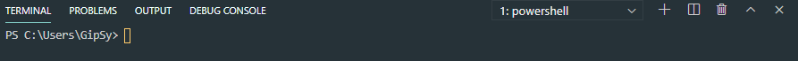
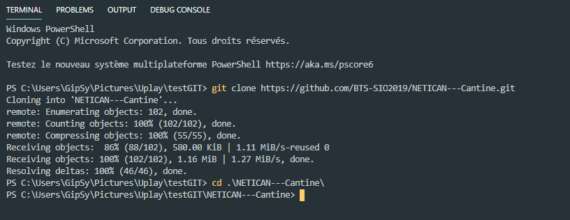
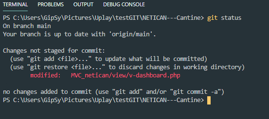
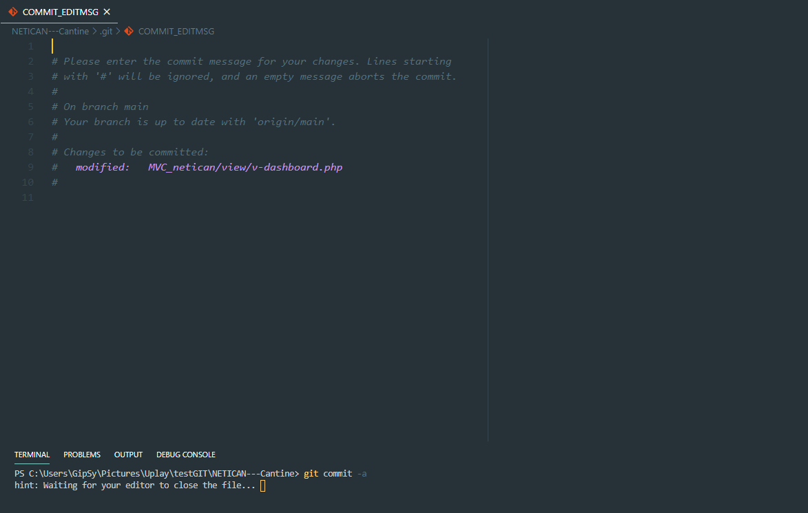
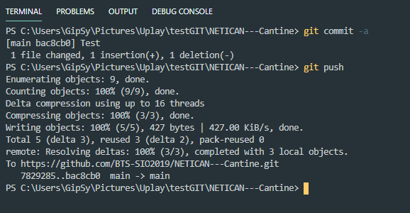
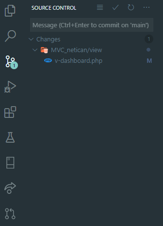
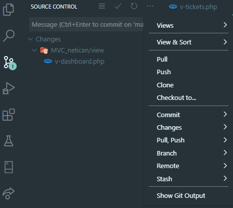

# Utilisation de Git

## 1. **Installation du SCM de Git**

Pour l'installation du SCM de git il faut ce rendre sur le site <https://git-scm.com> et de télécharger le logiciel pour windows. Git SCM est une console qui permet de gérer le versionning en local ou sur internet (GitHub...).

Suivre les consignes pendant l'installation, surtout il faut faire attention à changer l'éditeur par défaut si nécessaire (Ex : mettre visualStudio par défaut ou Atom etc).

>  *Important : pensez à redémarrer votre système après l'installation* 

Pour initialiser votre compte a git, il vous suffit d'inscrire ces commandes suivantes :

    git config --global user.email "your_email_address@example.com"
    git config --global user.name "your_name"

## 2. **Extension à ajouter pour l'utilisation de Git dans VisualStudio Code**

Sur VisualStudio Code l'implémentation de Git est de base dans le logiciel. Pour faciliter l'utilisation de Git, il est conseillé d'avoir l'extension GitHub Pull Request and Issue. Cette extension permet :

* Une authentification plus simple et rapide à Github

* Simplification du travail sur les Issues et les Requests

* Possiblité à partir de VS Code de mentionner une personne active du projet

## 3. **Utilisation de Git à partir du terminal de VS Code**

Pour l'utilisation de Git dans VS Code il suffit d'ouvrir un terminal en utilisant le commande :

    CTRL + SHIFT + ù

Une fois dans le terminal il faut ce positionner dans le dossier qui doit accueillir le/les projet(s) de GitHub ou le dossier de l'application en cours de développement. Pour cela on utilise les commandes suivantes :

    cd /leDossierRacine/MonProjet

Dès lors que vous êtes positionné dans le dossier cible, il faut inscrire la commande :

    git clone "URL DU REPOSITORY"

> *Cette commande a permis au SCM de git d'ajouter des fichiers pour permettre le bon fonctionnement du versionning et de télécharger les fichiers du projet.*

Après avoir executer la commande précedente, il faut ce positionner dans le dossier qui vient d'être télécharger.

    /leDossierRacine/MonProjet cd monRepository

**Voici le résultat :**

> 

### *Dès lors que le clonage du Repository est fait, vous pouvez librement changer les fichiers concernés par vos tâches.*

---

Une fois les modifications effectuées il va falloir valider les changements faits. Pour cela on vérifie déjà si toute les évolutions ont été pris en compte avec la commande suivante :

    git status

> *Comme dans l'image ci-dessus, on peut s'apercevoir qu'il y a eu un changement sur le fichier MVC_netican/view/v-dashboard.php. Il faut bien faire attention au(x) fichier(s) modifié(s) que ce soit le(s) bon(s)*

Suite à la vérification de(s) fichier(s) il faut ensuite utliser la commande :

    git commit -a

> *Enregistre des instantanés de fichiers de façon permanente dans l'historique des versions*
> *Le fichier ouvert automatiquement par la commande est utile si vous souhaitez faire un commentaire sur ce que vous avez fait(s). Pour effectuer le commit il suffit de fermer le fichier.*

La dernière étapes est de push notre commit sur GitHub, pour cela il nous suffit d'utiliser la commande :

    git push

## Informations complémentaire

> Voici quelque informations pratique pour la visualisation de git sur VSCode

1. **La visualisation des modifications sur un ou plusieurs fichier(s)**

<<<<<<< HEAD
1. **Utilisation des actions présente sur VSCode**
=======
2. **Utilisation des actions présente sur VSCode**
>>>>>>> 315cc120d32e2696c9e1c9d348756c80e18b7e17

Nom | Description
--|--
Pull | Rapatrier et intégrer un autre dépôt ou une branche locale
Push | Met à jour les références distantes ainsi que les objets associés
Clone | Clone un dépôt dans un nouveau répertoire
Checkout | Bascule sur une autre branche ou restaure des fichiers de l’arbre de travail
Commit | Enregistre des instantanés de fichiers de façon permanente dans l’historique des versions
Change | Inconnu pour l'instant
Pull, Push | Rapatrier et intégrer un autre dépôt ou une branche locale / Met à jour les références distantes ainsi que les objets associés
Branch | Liste, crée, ou supprime des branches
Remote | Gère un ensemble de dépôts (« distants ») dont vous suivez les branches.
Stash | Remettre en ordre tout les fichiers

## *Ceci n'est qu'un aperçu des commandes utiles pour l'utilisation de GIT*
